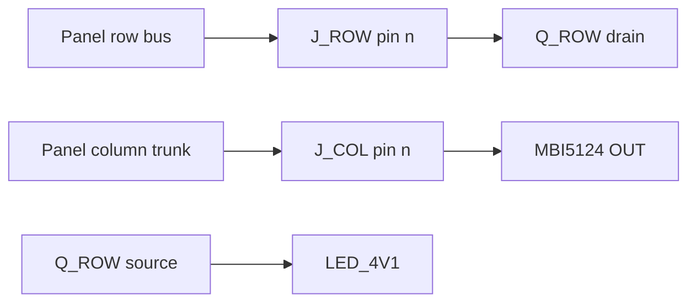

# Route mono electronics matrix copper

## Goal Capsule

- Objective: The shared electronics board presents the same row and column nets on the same FFC pins as both black-and-white panels, with each of those nets continuous from the driver pad to the connector.
- Means: Generate that copper in the existing board generator, after the column pads are moved onto the MBI5124 output pins named by its datasheet (KTD1, KTD2).
- Authority: This plan, then `hardware/common/MONO_SPLIT_ARCHITECTURE.md` for pin names, then `cursor.md` for DRC and fabrication limits. `hardware/common/PCB_ARCHITECTURE.md` still describes the RGB rail and a 28-row farm; do not copy those numbers onto this board.
- Execution: characterization of the DRC report shape first, then pin-map correction, then copper. Routing lives in the generator so a later regenerate cannot drop it.
- Stop: Stop after the matrix nets in R1–R3 are each a single connected group and both panels still pass their existing connectivity gate. Do not start decoder gates, MBI serial, the buck, the MCU, outline shrink, a schematic, or firmware.
- Finishes the work: the implementer who lands U1–U5 and leaves the verifier green.

## Product Contract

### Summary

The 20×20 and 32×32 panels already carry every populated row and column to two 40-pin cables. The electronics board has the same pin names and the driver parts, and no copper. This plan joins each matrix net on that board from the driver pad to the matching cable pin, and joins the LED anode rail across the transistor sources that already use it. Large outlines stay. RGB boards stay.

Product Contract created by ce-plan-bootstrap. No upstream requirements document.

### Problem Frame

A panel can be plugged into the electronics board and still have an open row or column, because those nets exist only as pad labels. The column labels are also on SSOP pins 2–9 and 15–22, which is not a checked map of MBI5124 outputs. Drawing tracks on that map would lock the wrong pins.

### Key Decisions

- Black-and-white only (session-settled: user-directed — chosen over continuing the RGB wearables: the RGB pair is paused). Governs R7.
- Separate panel and electronics board on two 40-pin cables (session-settled: user-directed — chosen over one two-sided board: the implemented split stays). Governs R1, R2.
- 20×20 and 32×32 on one 32-channel electronics board (session-settled: user-approved — chosen over a 28×28 high-resolution panel: both panels already use that pinout). Governs R1, R2, R4.
- Full wearable set stays on the electronics board (session-settled: user-directed — chosen over a driver-only board: parts already placed are not removed). Governs R8.
- Spacious outlines first (session-settled: user-directed — chosen over packing the first layout: 44 mm panel margin and the 140×90 mm electronics outline stay). Governs R5.

### Requirements

- R1. On the electronics board, `ROW_01_ANODE` through `ROW_32_ANODE` are each one connected copper group from `Q_ROW` pad 3 (drain) to `J_ROW` pin n.
- R2. On the electronics board, `COL_01` through `COL_32` are each one connected copper group from the datasheet output pin of `U_LED1` or `U_LED2` to `J_COL` pin n. `U_LED1` carries columns 1–16 and `U_LED2` carries columns 17–32.
- R3. `LED_4V1` is one connected group across every pad that already names it: the 32 PMOS sources and the assigned pad of each `R_PU`.
- R4. Both panels keep 400 and 1024 LEDs, rear-only connectors, two layers, the current outlines, the current pinout, zero geometric DRC violations, and zero unconnected items.
- R5. The electronics board stays four-layer, 140×90 mm, with zero geometric DRC violations and no part in the bottom branding strip.
- R6. The verifier reads KiCad 10's top-level `unconnected_items` array. It fails if any net in R1–R3 is still split. It does not fail because MCU, power, or audio pads are still open.
- R7. `hardware/wearable_20x20` and `hardware/wearable_28x28` are not modified.
- R8. Placed wearable parts stay. Pads that have no net today do not gain invented signal names in this plan.

### Scope Boundaries

Deferred for later:

- Schematic capture, fabrication package, outline shrink, and firmware.
- Row decoder, gate resistors, translator, MBI serial, `Rext`, and the 4.24 V buck. Those pads stay unnamed except where a net already exists.
- Paralleling FFC spare pins 33–40 onto outer rows.

Outside this product's identity:

- Further RGB wearable layout.

### Acceptance Examples

- AE1. Covers R2. Given the current generator map of `U_LED1` pads 2–9 to `COL_01`–`COL_08`. When the pin map is corrected from the MBI5124 pin table. Then those column nets sit on the output pins, and no column track is drawn until that move is in the generator.
- AE2. Covers R1, R6. Given `ROW_01_ANODE` on both a PMOS drain and `J_ROW` pin 1 with no track. When verification runs. Then the net is reported split. After the route exists, that net is absent from `unconnected_items`.
- AE3. Covers R6, R8. Given open MCU pads. When matrix nets are connected. Then verification still passes, and the printed unconnected count is the length of the top-level array, not zero.
- AE4. Covers R4. Given the 20×20 panel. When electronics columns 21–32 are routed. Then panel pins 21–40 stay without those nets.

### Sources

- `hardware/tools/generate_mono_split_boards.py` places electronics parts and routes only the panels. Column fan-in stops 8 mm above the FFC pad and drops on the pad centerline.
- `hardware/tools/verify_mono_split_boards.py` looks for unconnected items inside `violations`. KiCad 10.0.6 stores them in top-level `unconnected_items` (134 groups on the current electronics board, 0 on each panel).
- `hardware/common/MONO_SPLIT_ARCHITECTURE.md` is the pinout contract. `DATASHEET_BOM_FREEZE.md` cites the MBI5124 preliminary datasheet for the output-pin table. The pin numbers were not copied into this plan.
- `cursor.md` records the FFC diagonal-into-pad failure, the USB stacked-pad rule, and the silk rules. `docs/solutions/` does not exist. No Compound Pack was configured.
- Assumption: electronics pin n keeps the same net as panel pin n. How the physical cable faces those two receptacles is a cable-order check, not a reason to reverse the nets in this plan.
- Document review: coherence and feasibility corrections are in the units above. The MBI5124 pad numbers stay in the datasheet until U2 copies them; they are not guessed here. Cross-model review did not run because this host's serving model family is unknown.
- Bake-off was not run. The column approach-then-vertical pattern is already in the generator, so a second routing mechanism did not need to be developed.

## Planning Contract

### Key Technical Decisions

- KTD1. Column pads are reassigned from the MBI5124 datasheet pin table before any `COL_*` track is created. The current pads 2–9 and 15–22 stay in the generator only until that replacement. Rationale: those pad numbers were not checked against the output list, and copper on them is expensive to unwind.
- KTD2. Matrix copper is emitted by `generate_mono_split_boards.py`. On the electronics board both FFC receptacles are unflipped and rotated so their pads share one X and step in Y. The last segment into each pad is a horizontal stub on that pad's Y centerline, starting west of the courtyard. Do not copy the panel column's vertical drop. Rationale: a vertical track on the shared X crosses every pad in the column. The saved PCB is generator output; a hand route disappears on the next run. Inner layers may carry the long runs.
- KTD3. This plan connects only nets that already have two or more pads: the 32 row anodes, the 32 columns, and `LED_4V1`. Decoder gates, MBI serial, and the buck stay open. Rationale: those circuits are specified in the architecture notes but their passives and pin assignments are not on the board, and schematic capture was deferred.
- KTD4. Electronics `unconnected_items` remain a warning in the project file. The verifier fails only when a net from R1–R3 appears in that list. Rationale: a board-wide zero is the later schematic milestone, and the current script hides the real count.

### High-Level Technical Design



Row n and column n use the same net name on the panel and on the electronics board. The new copper is only the right-hand hop on the electronics board. `LED_4V1` ties the PMOS sources together and does not touch the drains. It does not yet reach the buck.

### Sequencing

U1 locks the DRC report shape. U2 depends on U1 and moves column nets onto datasheet output pins. U3 and U4 depend on U2 and can proceed in either order. U5 depends on U3 and U4. It joins `LED_4V1` and turns on the matrix connectivity gate.

## Implementation Units

### U1. Count unconnected items from the KiCad 10 report

- Goal: The verifier's unconnected count is the length of top-level `unconnected_items`, for panels and for the electronics board.
- Requirements: R4
- Files: `hardware/tools/verify_mono_split_boards.py`
- Approach: Read the top-level array. Keep the electronics project severity as a warning. Do not require the matrix nets to be joined yet. Print the real count.
- Execution note: Characterization first. The current electronics report is the fixture: geometric violations empty, unconnected groups present.
- Test scenarios:
  - Happy path: a fresh electronics DRC report with an empty `violations` array and a non-empty top-level `unconnected_items` array prints that length and does not raise for geometry.
  - Edge: both panel reports have an empty top-level array and still pass.
  - Error: if `unconnected_items` is missing, verification raises instead of treating the count as zero.
- Verification: `python3 hardware/tools/verify_mono_split_boards.py` exits 0, and the electronics line shows a non-zero unconnected count.

### U2. Move column nets onto MBI5124 output pins

- Goal: `COL_01`–`COL_16` are on `U_LED1` output pins and `COL_17`–`COL_32` are on `U_LED2` output pins, per the datasheet pin table cited from `DATASHEET_BOM_FREEZE.md`.
- Requirements: R2, R5, R7
- Dependencies: U1
- Files: `hardware/tools/generate_mono_split_boards.py`, `hardware/mono_electronics/mono_electronics.kicad_pcb`, `hardware/common/MONO_SPLIT_ARCHITECTURE.md`, `hardware/tools/verify_mono_split_boards.py`
- Approach: Read the MBI5124 pin table from the datasheet cited in `DATASHEET_BOM_FREEZE.md`. Replace the pad-number map in `electronics_parts()` with that table. Copy the table into `hardware/common/MONO_SPLIT_ARCHITECTURE.md`. Regenerate. Do not add column tracks in this unit. Leave power, `Rext`, and serial pads unnamed. The verifier fails if `COL_01` is still on `U_LED1` pad 2, which is the unchecked map.
- Test scenarios:
  - Happy path: after regenerate, `U_LED1` output pin for channel 0 has net `COL_01`, and `J_COL` pin 1 still has `COL_01`.
  - Edge: pads that the datasheet names as `SDI`, `CLK`, `LE`, `OE`, `R-EXT`, `VDD`, `GND`, and `SDO` do not receive a `COL_*` net.
  - Error: geometric DRC on the regenerated electronics board is still empty. If the new pad assignment shorts two nets, fix the map before continuing.
- Verification: pinout section of `python3 hardware/tools/verify_mono_split_boards.py` passes, and a pad dump shows column nets only on output pins.

### U3. Route each row anode to its FFC pin

- Goal: R1 is true, and the route is produced by the generator.
- Requirements: R1, R4, R5
- Files: `hardware/tools/generate_mono_split_boards.py`, `hardware/mono_electronics/mono_electronics.kicad_pcb`
- Dependencies: U2
- Approach: From `Q_ROWnn` pad 3 to `J_ROW` pin n. The last segment is a horizontal stub on F.Cu along that pad's Y, starting west of the courtyard. It must not touch the pad above or below, including pin 32 where spare pins continue past it. Use an inner layer for the long run if the transistor farm blocks a direct track. Do not route gates.
- Test scenarios:
  - Happy path: `ROW_16_ANODE` is absent from electronics `unconnected_items` and is present on both the PMOS drain and `J_ROW` pin 16.
  - Edge: the horizontal stub into pin 1 does not touch pin 2. The stub into pin 32 does not touch pin 31 or pin 33.
  - Integration: both panels still report zero unconnected items after regenerate.
- Verification: electronics geometric DRC has no short, clearance, or courtyard hit on the new row copper. `ROW_01_ANODE` through `ROW_32_ANODE` do not appear in `unconnected_items`.

### U4. Route each column to its FFC pin

- Goal: R2 is true on the corrected output pins.
- Requirements: R2, R4, R5
- Dependencies: U2
- Files: `hardware/tools/generate_mono_split_boards.py`, `hardware/mono_electronics/mono_electronics.kicad_pcb`
- Approach: Fan from both MBI packages toward `J_COL` on the right edge. The last segment is a horizontal stub on F.Cu along that pad's Y, starting west of the courtyard. Do not drop vertically through the pad column.
- Test scenarios:
  - Happy path: `COL_01` connects `U_LED1`'s first output pin to `J_COL` pin 1, and `COL_32` connects `U_LED2`'s last output pin to `J_COL` pin 32.
  - Edge: the horizontal stub into pin 20 does not touch pin 19 or pin 21. The stub into pin 32 does not touch pin 33.
  - Error: if two column tracks cross on the same layer, move one to another copper layer instead of narrowing below the 0.15 mm fan-in width.
- Verification: `COL_01` through `COL_32` do not appear in electronics `unconnected_items`. Geometric DRC stays empty.

### U5. Join the LED anode rail and enforce the matrix gate

- Goal: R3 and R6 are true together.
- Requirements: R3, R5, R6, R8
- Dependencies: U3, U4
- Files: `hardware/tools/generate_mono_split_boards.py`, `hardware/tools/verify_mono_split_boards.py`, `hardware/mono_electronics/mono_electronics.kicad_pcb`, `hardware/common/MONO_SPLIT_ARCHITECTURE.md`, `hardware/LAST_CHANGES.md`
- Approach: Connect every pad that already belongs to `LED_4V1`. An inner-layer pour or a trunk is acceptable. Do not add the buck, the decoder VCC pins, or new passives. Extend the verifier so any remaining `unconnected_items` entry whose description contains `ROW_`, `COL_`, or `LED_4V1` fails the electronics check. Update the architecture DRC-scope sentence so it matches this gate. Note the change in `hardware/LAST_CHANGES.md`.
- Test scenarios:
  - Happy path: one `LED_4V1` group includes all 32 PMOS sources. The verifier exits 0. The printed leftover count covers only non-matrix nets.
  - Edge: `ROW_SPARE_33` and `COL_SPARE_40` may remain single-pad nets and do not fail the gate.
  - Error: deleting the track on `ROW_01_ANODE` makes verification fail with that net named.
- Verification: `python3 hardware/tools/verify_mono_split_boards.py` exits 0. Electronics geometric violations are zero. Matrix nets are absent from `unconnected_items`.

## Verification Contract

Run from the repository root:

```bash
python3 hardware/tools/verify_mono_split_boards.py
```

That command regenerates nothing. It loads the three boards, checks pinout and panel geometry, and runs `kicad-cli pcb drc`. The electronics check must use top-level `unconnected_items`.

Before calling U5 done, regenerate with `python3 hardware/tools/generate_mono_split_boards.py` and run the verifier again, so the saved PCBs match the generator.

No release or package validate script exists for this repository. Do not treat a green RGB board DRC as evidence for this work.

## Definition of Done

- U1–U5 are complete and the verifier exits 0 on the regenerated boards.
- R1–R8 hold.
- Abandoned routing experiments are not left in the generator or in the saved PCBs.
- `hardware/LAST_CHANGES.md` names the matrix-copper change.
- RGB project files have an empty diff.
